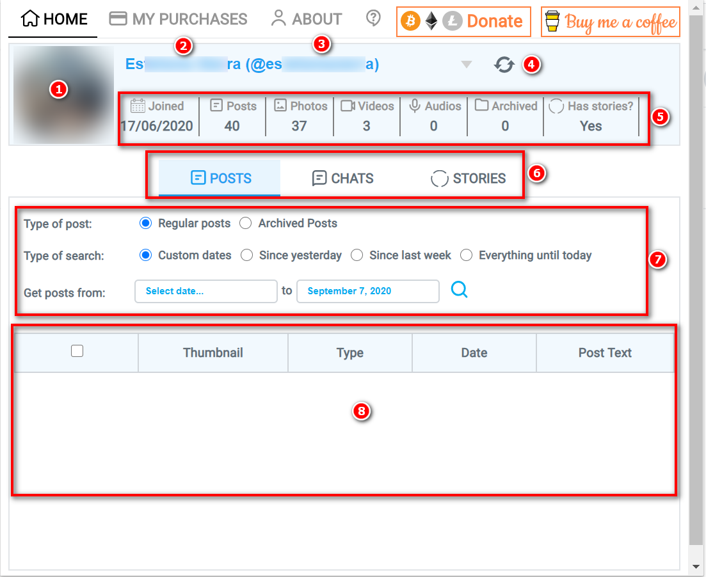
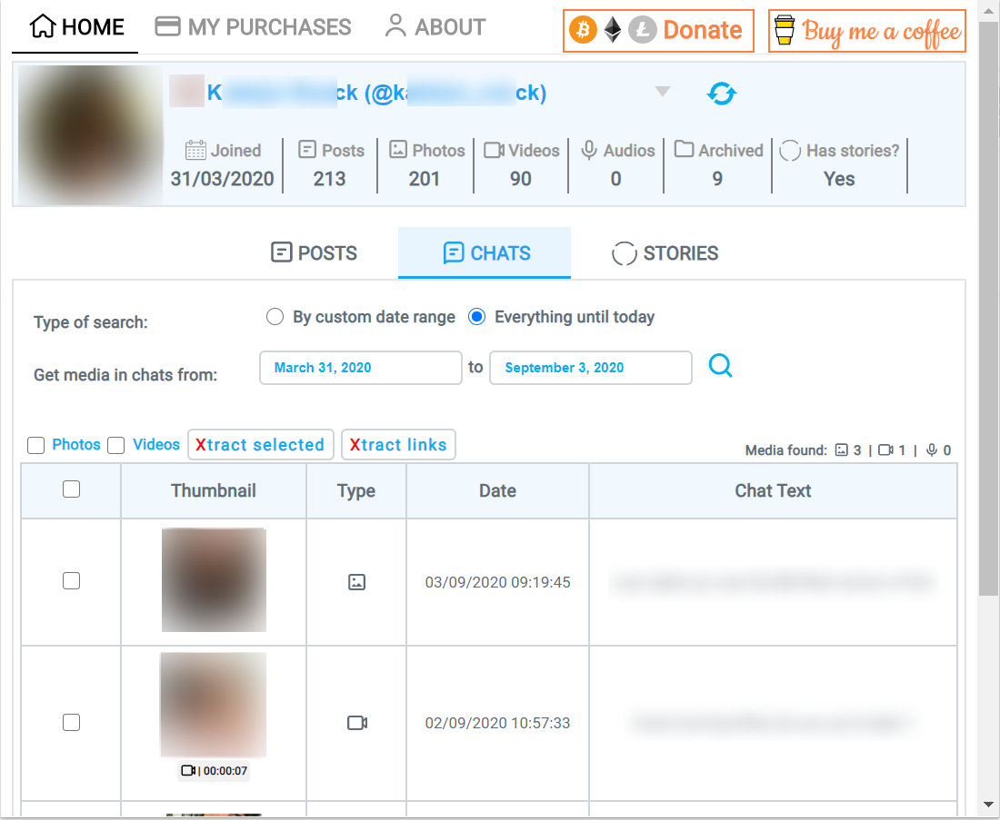

# Tutorial

Contents

<ul class="toc_list">
  <li><a href="#direct-download">1 Download content directly from OnlyFans site</a>
  
</li>
<li><a href="#extension-download">2 Download content from the extension page</a>
  <ul>
    <li><a href="#layout">2.1 Extension page layout</a></li>
    <li><a href="#posts">2.2 Posts tab</a></li>
    <li><a href="#chats">2.3 Chats</a></li>
    <li><a href="#stories">2.4 Stories</a></li>
    <li><a href="#purchases">2.5 My Purchases</a></li>
  </ul>
</li>
<li><a href="#install">3 Install extension manually before it's published</a>
  <ul>
    <li><a href="#install-chrome">3.1 Manual installation steps for Google Chrome</a></li>
    <li><a href="#posts">3.2 Manual installation steps for Mozilla Firefox</a></li>
  </ul>
</li>
</ul>

---

## 1 Download content directly from OnlyFans page
  The extension allows you to download content from two possible places: directly from the OnlyFans site or by a popup window that opens up when you click on the extension icon. Here we'll cover the first case.
  
  While navigating in OnlyFans, below each post you will be able to see the following buttons:
  

  
  

  
  Here's a summary of each button's action:
  
<table class="tutorial-table">
<thead>
<tr>
<th>Button text</th>
<th>Action</th>
</tr>
</thead>
<tbody>
<tr>
<td>Xtract photo</td>
<td>Downloads the photo to your PC</td>
</tr>
<tr>
<td>Xtract video</td>
<td>Downloads the video to your PC</td>
</tr>
<tr>
<td>Xtract ALL</td>
<td>Download all photos and videos from the current post to your pc</td>
</tr>
<tr>
<td>Xtract links</td>
<td>Copy the links to download the photos and videos to your clipboard</td>
</tr>
</tbody>
</table>
<a href="#top">Back to top</a>

---

## 2 Download content from the extension page

To enable this option, you have to click on the extension button that is displayed in your browser's bar:

  

          <h4>Important!</h4>
          

            You HAVE TO click on this button while being on a tab where OnlyFans is open. Otherwise you'll get a message
            saying so...
          

The following window will pop up:

  

As you can see, it prompts you to select a user. When you click that message, a list with all your subscriptions will be displayed:

  

<a href="#top">Back to top</a>

---

## 2.1 Extension page layout

If you select any of your susbcriptions (see 2.1), you will get the following info from the user:

  

* **Section 1:**  Creator's profile picture
* **Section 2:**  Creator's Name
* **Section 3:**  Creator's user handle
* **Section 4:**  Button to reload user list (use it when outdated info is being displayed)
* **Section 5:**  Creator's basic info:
  * Joined: Date the creator joined instagram
  * Posts: Number of posts
  * Photos: Number of photos posted
  * Videos: Number of videos posted
  * Audios: Number of audios posted
  * Archived: Number of posts the user has archived
  * Has stories: Indicates wether this creator has stories or not
* **Section 6:**  Toggle between posts, chats and stories
* **Section 7:**  Selection parameters (self explanatory)
* **Section 8:**  When you hit the search button (magnifier glass), the content that meets the search criteria will be displayed in this table

<a href="#top">Back to top</a>

---

## 2.1 Posts tab

While being in the posts tab, you will be able to retrieve the selected creator's posts that contain multimedia.

          <h4>Important!</h4>
          

            Posts that only contain text, but no photo/video/audio will not be displayed. The extension's main purpose is to download multimedia, not
            browse OnlyFans posts.
            Also, posts contaning locked media (media you have to purchase to see, but you haven't purchased yet) will not be displayed either. Once you purchase
            locked media, then you will be able to download it using this extension
          

First you have to select wether you want to select regular posts (posts you usually see when yo go to the creator's page in OnlyFans) or archived posts (posts the creator removed from the main feed but are still accessible from the archived section in OnlyFans).

Then indicate if you want to get: Posts in custom date range, posts since yesterday, posts since last week (7 days back until today) or all the posts since the creator joined OnlyFans.
If you selected posts in custom date range, then you will have to provide the "date from" and "date to" (default = today) that will be used to search for posts. For all other options, "date from" and "date to" are automatically filled.

Finally hit the search button (magnifying glass) and see the magic happen!

Depending on the number of posts the user has according to the selection criteria you entered, the main table will be filled like this:

  

As you can see, the table displays the thumbnail of the multimedia, duration (only in the case of videos), media type, publish date and post text (if any).

Above the table the following controls are enabled:
* **Pictures:** Select/unselect all pictures from the table
* **Videos:** Select/unselect all videos from the table
* **Xtract selected:** Download the selected multimedia to your hard drive
* **Xtract links:** Copy the links to the selected multimedia to the clipboard
* **Multimedia found:** Indicates the number of photos, videos and audios being displayed in the table

<a href="#top">Back to top</a>

---

## 2.2 Chats tab

While being in the chats tab, you will be able to retrieve the multimedia the creator has sent you via direct message.

          <h4>Important!</h4>
          

            Only viewable multimedia will be displayed. Those multimedia messages the creator sends for you to purchase, but you havent's purchased yet
            will not be shown.
          

First you have to indicate if you want to get chat multimedia in custom date range or all the posts since the creator joined OnlyFans.
If you selected custom date range, then you will have to provide the "date from" and "date to" (default = today) that will be used in the search.

Finally hit the search button (magnifying glass) and see the magic happen!

Depending on the number of posts the user has according to the selection criteria you entered, the main table will be filled like this:

  

As you can see, the table displays the thumbnail of the multimedia, duration (only in the case of videos), media type, publish date and chat text (if any).

Above the table the following controls are enabled:
* **Pictures:** Select/unselect all pictures from the table
* **Videos:** Select/unselect all videos from the table
* **Xtract selected:** Download the selected multimedia to your hard drive
* **Xtract links:** Copy the links to the selected multimedia to the clipboard
* **Multimedia found:** Indicates the number of photos, videos and audios being displayed in the table

<a href="#top">Back to top</a>

---

## 2.3 Stories tab

While being in the stories tab, you will be able to retrieve the selected creator's stories (if any).

In this case you don't have to input any selection criteria, just click the search button and the stories will be displayed in the table below.

If the creator has posted stories, the main table will be filled like this:

  

As you can see, the table displays the thumbnail of the multimedia, duration (only in the case of videos), media type, and publish date.

Above the table the following controls are enabled:
* **Pictures:** Select/unselect all pictures from the table
* **Videos:** Select/unselect all videos from the table
* **Xtract selected:** Download the selected multimedia to your hard drive
* **Xtract links:** Copy the links to the selected multimedia to the clipboard
* **Multimedia found:** Indicates the number of photos, videos and audios being displayed in the table

<a href="#top">Back to top</a>

---

## 2.4 My purchases

This tab is located at the top of the extension window, next to the "Home" tab.

Once you're there, you will be able to search for all the content you have ever purchased from any creator, wether you are currently subscribed or not.

You don't have to specify any search criteria, just press the search button!

If you have ever purchased content from any creator, the main table will be filled like this:

  

As you can see, the table displays the thumbnail of the multimedia, duration (only in the case of videos), media type, publish date and text (if any).

Above the table the following controls are enabled:
* **Pictures:** Select/unselect all pictures from the table
* **Videos:** Select/unselect all videos from the table
* **Xtract selected:** Download the selected multimedia to your hard drive
* **Xtract links:** Copy the links to the selected multimedia to the clipboard
* **Multimedia found:** Indicates the number of photos, videos and audios being displayed in the table

<a href="#top">Back to top</a>

---

## 3 Install extension manually before it's published

Sometimes I'll come up with a new version of the app that fixes some bugs or introduce new features. Well, Chrome and Firefox stores sometimes take a long time to review the new version before allowing it to be published (especially Chrome). That's why I give you the option to download the new version from this site and install it manually until it's officially available in the stores. (You may go to the [downloads section](/downloads) to find the latest version).

The steps to add an extension manually differs for each browser. Please go to the tutorial section corresponding to the browser where you want to install it.

<a href="#top">Back to top</a>

---

## 3.1 Manual installation steps for Google Chrome

For google chrome, the installation process is rather easy:

* Download the latest version for Google Chrome from the [downloads section](/downloads).
* Type the following in Chrome's address bar: `chrome://extensions/` and enable "developer options":

  

* Finally just drag and drop the zip you downloaded from the [downloads section](/downloads) to `chrome://extensions/`:

  

* The extension will appear on the list. When a new version is available in Chrome store, just delete it manually and install from the store.

<a href="#top">Back to top</a>

---

## 3.2 Manual installation steps for Mozilla Firefox
